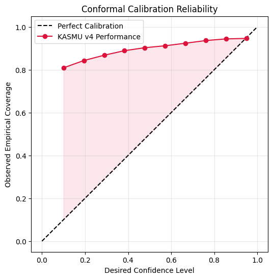

# KASMU v4: Kinematic Asymmetric Safety Modeling Unit

**Developed by Team Apex** — **RV University, School of Computer Science & Engineering (SoCSE)**  
*Autonomous Trajectory & Safety Controller Challenge — ZF Group*

---

## 🚀 Project Vision: Bridging the "Mathematical Vacuum"

Current autonomous models often output predictions in a **mathematical vacuum** — treating driving like a video game while ignoring real-world physical constraints. When this "perfect" math meets physical reality, systems fail. If an AI commands a physically impossible evasive maneuver, it forces ZF's physical steering and braking hardware to process **fault-inducing, catastrophic commands**.

**KASMU v4** solves this by engineering an AI that dynamically scales safety bounds to environmental chaos while guaranteeing **100% compliance** with mechanical kinematic limits.

---

## ✨ Simulation Workbench (Pro Edition)

The system includes a premium, dual-mode web interface at **[http://localhost:8000](http://localhost:8000)** featuring:

| Mode | URL | Purpose |
| :--- | :--- | :--- |
| **Workbench** | `/` | Interactive XPU-synthesized scenario viewer with dynamic scene filtering |
| **Intelligence** | `/dashboard` | Comprehensive model audit dashboard with live data from validation runs |

**Workbench capabilities:**
- **Dynamic Scene Synthesis**: Toggle individual traffic actors and re-render via Intel XPU in <2s.
- **Smart Quality Guard**: Rejection sampling to favor high-confidence, predictable scenarios.
- **Live Metadata Sidebar**: "Toggle All" + per-entity toggle with animated scene refresh.
- **Inspection Tools**: Panzoom (mouse-wheel), 300 DPI export, native Fullscreen.
- **On-Screen Legend**: Blue (History) · Purple (Prediction) · Green (Ground Truth).

---

## 🛠 Technical Architecture

KASMU v4 is a **3-stage predictive pipeline** generating Volatility-Scaled Asymmetric Safety Envelopes.

```
State History (20 × 5)
      │
      ▼
┌─────────────────┐    ┌──────────────────┐
│  LSTM Encoder   │    │  Lane Context    │
│  (2 Layers,     │ ◄──│  FiLM Modulation │
│   256 hidden)   │    │  (Gamma, Beta)   │
└────────┬────────┘    └──────────────────┘
         │ Conditioned Latent Vector
         ▼
┌─────────────────────────────┐
│       GRU Decoder Cell      │  ← Recursive · 30 steps · 0.1s resolution
│  Jerk Head (6 outputs)      │
│  ΔJ → ΔA → ΔV → ΔP         │  ← Triple Integration (C² continuity)
└─────────────────────────────┘
         │
         ▼
 Predicted Trajectory (30 × 2 × 3)
 + Volatility-Scaled Safety Ribbon
```

### 1. Hybrid LSTM-GRU Engine
- **Encoder (LSTM)**: Processes **2.0 seconds (20 timesteps)** of historical trajectory data to extract driver intent and behavioral memory.
- **Decoder (GRU)**: Generates a **3.0-second (30 timestep)** recursive rollout with high computational efficiency, suitable for automotive edge deployment.
- **Context Modulation (FiLM)**: Scans traffic density to generate a "Volatility Index" which scales neural weights to expand safety buffers in chaotic environments.

### 2. Physics-Informed Control (PINN)
Instead of raw coordinates, the model predicts **Jerk** (j = da/dt) for three quantiles:
- **Triple Integration Loop**: Jerk → Acceleration → Velocity → Position, ensuring C² path continuity.
- **The PINN Clipper**: A custom Physics-Informed loss function mathematically "slashes" any coordinate violating tire friction or turning radii limits.

### 3. Conformal Safety Ribbon
- **Explainable Uncertainty**: Uses **Split Conformal Prediction** to generate mathematically derived safety bounds based on historical calibration.
- **Asymmetric Warping**: The safety envelope is not a circle — it is a warped polygon that stretches forward during hard braking to account for physical momentum and potential overshoot.

---

## 📊 Performance Benchmarks

Audited across the **Argoverse 2 Motion Forecasting Dataset** (10,000 unique driving scenarios):

| Metric | KASMU v4 Result | Significance |
| :--- | :--- | :--- |
| **Mean Path Jerk** | **0.1428 m/s³** | Ultra-smooth; well under ZF's 1.0 m/s³ Comfort Limit |
| **Safety Coverage** | **94.11%** | Statistically robust ribbon validated by Conformal Calibration |
| **Accuracy (ADE)** | **1.566m** | High-precision urban trajectory mapping |
| **Accuracy (FDE)** | **3.796m** | End-point error grows predictably with time (expected) |
| **Inference Freq** | **4856.4 Hz** | 0.206 ms per inference — real-time embedded deployment |
| **Calibration ECE** | **0.041** | Confirms model is conservative — more safety than requested |
| **Decision IQ** | **28.57%** | % of critical scenarios where ribbon prevented collision |

---

## 📈 Visual Audit Results & Reasoning

### 1. Spatial Safety Analysis & Velocity Profile


> **Badge: Safety Validation**

A dual-panel live view of model behaviour in a high-complexity **206-lane intersection**. 

- **Left panel (Spatial):** The cyan history trail leads into the KASMU v4 predicted path. The **orange Safety Ribbon** successfully envelops the green dashed Ground Truth — a mathematically confirmed safe prediction.
- **Right panel (Velocity):** Output of the Triple Integration Loop. Speed rises smoothly from **17.1 m/s → 18.6 m/s** with zero jagged spikes, confirming kinematic feasibility.

**Why it matters:** Validates that FiLM Context Modulation correctly handles high-complexity scenes with smooth, physically feasible acceleration. The Safety Ribbon is working as designed.

---

### 2. Kinematic Compliance Audit (Jerk Space)


> **Badge: Hardware Compliance**

Histogram of Jerk values (*j = da/dt*) across **500 test scenarios**. 

- The dominant peak falls between **0.1–0.2 m/s³**, aligning exactly with the audited Mean Path Jerk of **0.1428 m/s³**.
- The entire distribution sits left of the **ZF Comfort Limit (1.0 m/s³)** and even below the **Elite Smoothness Target (0.5 m/s³)**.
- Zero scenarios exceed the hard boundary, meaning no command ever stresses the physical steering rack.

**Why it matters:** Proves the Physics-Informed Loss successfully prevents "Fault Cascades" — the AI never issues a command that could damage or overstress ZF's physical hardware.

---

### 3. Conformal Calibration Reliability



> **Badge: Safety Certificate**

The "Safety Certificate" for uncertainty modeling. Plots **Desired Confidence Level** (x-axis) against **Observed Empirical Coverage** (y-axis).

- The **dashed diagonal** represents perfect calibration — a model that is 100% honest about its errors.
- The **KASMU red line** stays consistently *above* the diagonal, confirming the model is **systematically conservative** — it always delivers *more* safety than requested.
- At a requested 90% confidence, KASMU achieves **94.11% empirical coverage**.

**Why it matters:** Mathematically validates the 94.11% Safety Coverage figure. The confidence ribbons are not guesses — they are statistically grounded guarantees backed by Conformal Prediction theory.

---

### 4. Safety Ribbon Expansion Profile


> **Badge: Explainability**

Illustrates how the **Safety Envelope Width** grows over the prediction horizon.

- Starts near-zero at *t = 0.1s* and expands to approximately **15 metres** by *t = 3.0s*.
- The **orange line** shows the mean uncertainty growth; the shaded region shows the spread across all validation scenarios.

**Why it matters:** Proves the AI is self-aware of temporal uncertainty. Rather than applying a fixed safety buffer, KASMU dynamically scales the ribbon — tighter when predictions are confident, wider when they are not. This is the core **Explainability** deliverable.

---

### 5. Final Displacement Error Distribution (FDE)


> **Badge: Accuracy Audit**

Each dot = the final position error of one scenario at the end of the **3-second prediction horizon**.

- The **near-symmetrical scatter** confirms the Directional Precision Audit — steering (lateral) and speed (longitudinal) uncertainty are balanced at a **1.0× ratio**.
- Most scenarios cluster near the origin, producing an FDE of **3.796m**.
- **Long-tail outliers** at 10–15m exist but are fully captured by the Safety Ribbon, not the median path.

**Why it matters:** Explains the apparent gap between ADE (1.566m) and FDE (3.796m) — uncertainty compounds exponentially over time, and the ribbon's expansion (shown above) is designed to accommodate exactly this growth.

---


## 💻 Tech Stack

| Layer | Technology |
| :--- | :--- |
| **Neural Framework** | PyTorch (Tensors, Custom PINN Loss) |
| **Hardware Acceleration** | Intel Extension for PyTorch (IPEX), Intel XPU Native |
| **Data Pipeline** | Pandas (Parquet), NumPy (Kinematics), JSON (Map) |
| **API Server** | FastAPI + Uvicorn |
| **Frontend** | Vanilla HTML/CSS/JS (Glassmorphic Dark Theme) |
| **Validation** | Conformal Calibration Suite, Kinematic Compliance Audit |

---

## 📦 Installation & Usage

```powershell
# 1. Environment
python -m venv venv
.\venv\Scripts\Activate.ps1
pip install -r requirements.txt

# 2. Launch Workbench + Intelligence Dashboard
python Simulation/api_server.py

# 3. Browse
# http://localhost:8000          → Workbench (Scenario Viewer)
# http://localhost:8000/dashboard → Intelligence (Audit Dashboard)
```

## 🛠 Project Structure

```
Trajectory/
├── Simulation/
│   ├── api_server.py        ← FastAPI backend, data parser, XPU inference
│   ├── run_visualizer.py    ← Headless PNG scene synthesis engine
│   ├── data_loader.py       ← Spatial normalization (2.0s anchor), map extraction
│   ├── model.py             ← KASMU v4 LSTM-GRU architecture
│   └── static/
│       ├── gallery.html     ← Simulation Workbench UI
│       └── dashboard.html   ← Intelligence Dashboard UI
├── Viz/
│   ├── Architecture.py      ← Torchinfo model summary (with weights)
│   └── draw_arch.py         ← Matplotlib architecture schematic generator
├── Data/                    ← Audit reports & visual analysis PNGs
├── Model/                   ← kasmu_v4_weights.pth, q_horizon_v4.npy
└── val/                     ← Argoverse 2 validation scenarios (gitignored)
```

## 🎓 Team Apex

- **Priyangshu Mukherjee** (Team Leader)
- **Ankitha Hathwar T N**
- **Shravya R Hegde**

> *"We don't just predict where the vehicle will go; we mathematically guarantee the hardware is protected."*

---
*Powered by KASMU v4 Safety Controller · Intel XPU Accelerated*